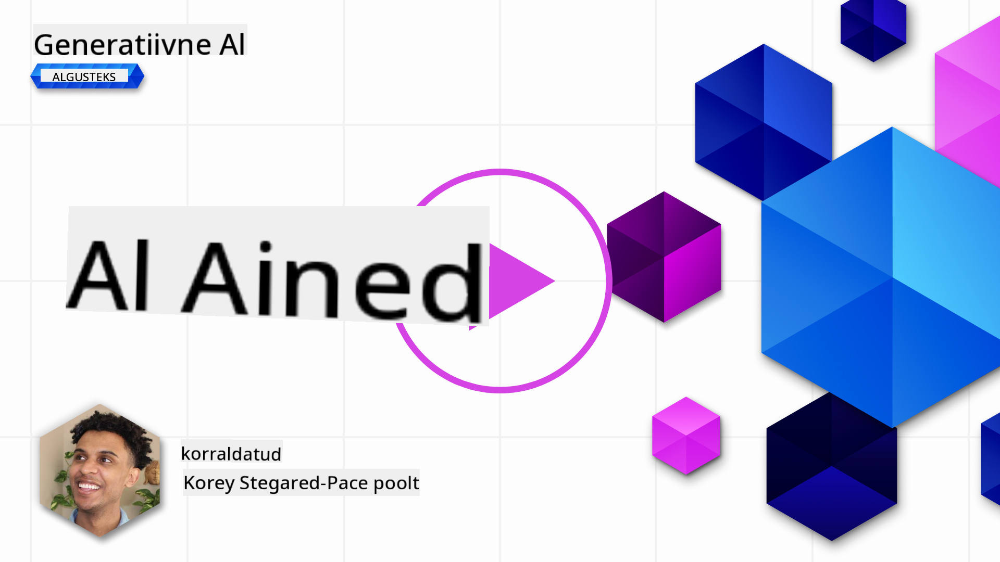
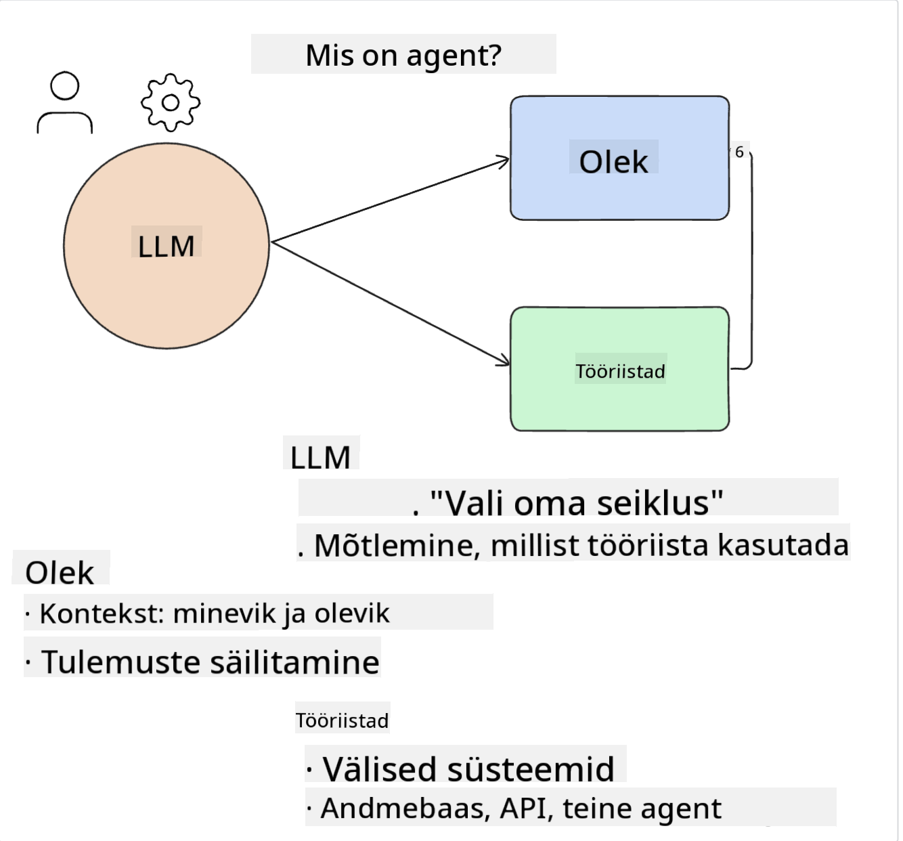
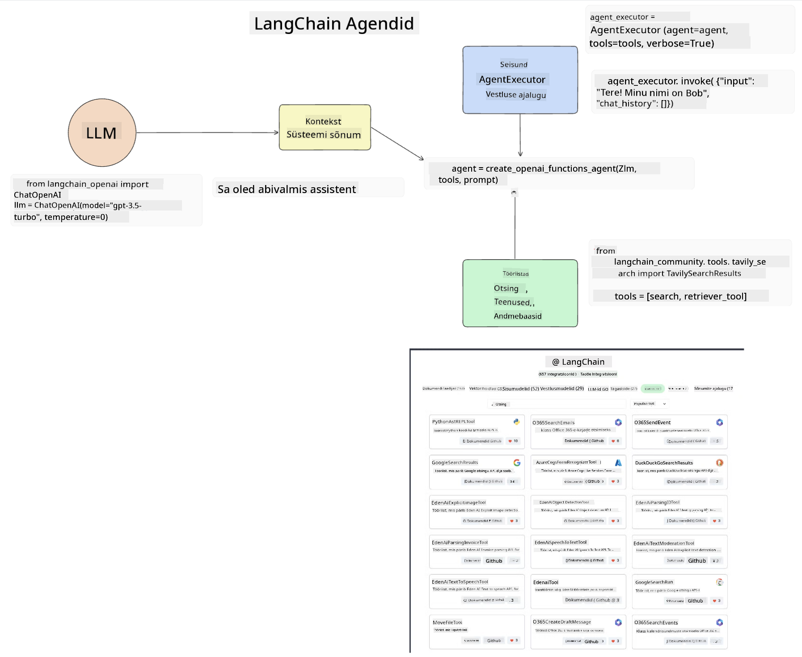
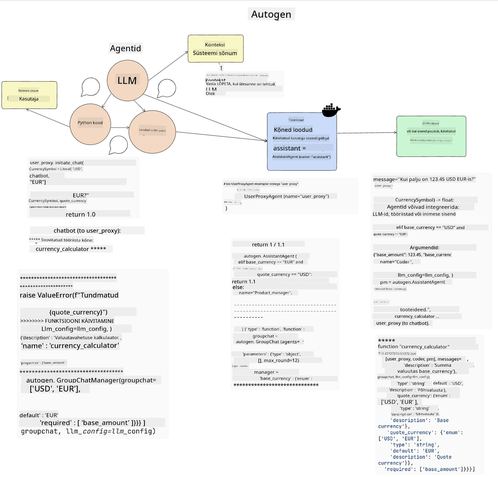
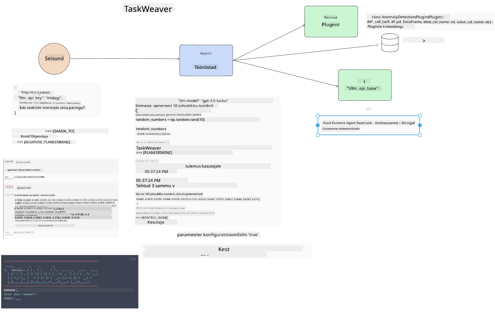
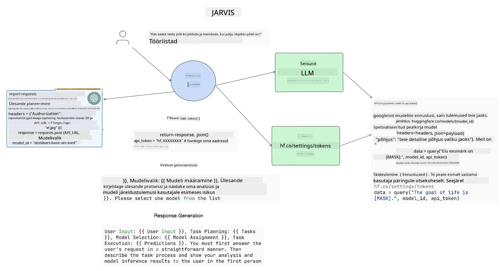

<!--
CO_OP_TRANSLATOR_METADATA:
{
  "original_hash": "8e8d1f6a63da606af7176a87ff8e92b6",
  "translation_date": "2025-10-18T02:57:54+00:00",
  "source_file": "17-ai-agents/README.md",
  "language_code": "et"
}
-->
[](https://youtu.be/yAXVW-lUINc?si=bOtW9nL6jc3XJgOM)

## Sissejuhatus

Tehisintellekti agendid (AI Agents) esindavad põnevat arengut generatiivse tehisintellekti valdkonnas, võimaldades suurte keelemudelite (LLM) arengut assistentidest agentideks, kes suudavad ise tegutseda. Tehisintellekti agentide raamistikud võimaldavad arendajatel luua rakendusi, mis annavad LLM-idele juurdepääsu tööriistadele ja oleku haldamisele. Need raamistikud parandavad ka nähtavust, võimaldades kasutajatel ja arendajatel jälgida LLM-ide kavandatud tegevusi, parandades seeläbi kogemuste juhtimist.

Selles õppetükis käsitletakse järgmisi teemasid:

- Mis on tehisintellekti agent? - Mis täpselt on tehisintellekti agent?
- Nelja erineva tehisintellekti agentide raamistiku uurimine - Mis teeb need ainulaadseks?
- Nende tehisintellekti agentide rakendamine erinevates kasutusjuhtudes - Millal peaksime tehisintellekti agente kasutama?

## Õpieesmärgid

Pärast selle õppetüki läbimist suudad:

- Selgitada, mis on tehisintellekti agendid ja kuidas neid kasutada.
- Mõista mõningate populaarsete tehisintellekti agentide raamistikude erinevusi ja nende eripärasid.
- Mõista, kuidas tehisintellekti agendid toimivad, et nende abil rakendusi luua.

## Mis on tehisintellekti agendid?

Tehisintellekti agendid on generatiivse tehisintellekti maailmas väga põnev valdkond. Selle põnevusega kaasneb sageli ka terminite ja nende rakenduste segadus. Et asju lihtsustada ja hõlmata enamikku tööriistu, mis viitavad tehisintellekti agentidele, kasutame järgmist definitsiooni:

Tehisintellekti agendid võimaldavad suurte keelemudelite (LLM) täita ülesandeid, andes neile juurdepääsu **olekule** ja **tööriistadele**.



Määratleme need terminid:

**Suured keelemudelid** - Need on mudelid, mida käsitletakse kogu kursuse jooksul, nagu GPT-3.5, GPT-4, Llama-2 jne.

**Olek** - See viitab kontekstile, milles LLM töötab. LLM kasutab oma varasemate tegevuste ja praeguse konteksti teavet, et suunata oma otsuste tegemist järgnevateks tegevusteks. Tehisintellekti agentide raamistikud võimaldavad arendajatel seda konteksti lihtsamalt hallata.

**Tööriistad** - Kasutaja taotletud ja LLM-i kavandatud ülesande täitmiseks vajab LLM juurdepääsu tööriistadele. Mõned tööriistade näited võivad olla andmebaas, API, väline rakendus või isegi teine LLM!

Need definitsioonid peaksid andma hea aluse edasiseks uurimiseks, kuidas neid rakendatakse. Vaatame mõningaid erinevaid tehisintellekti agentide raamistikke:

## LangChain Agents

[LangChain Agents](https://python.langchain.com/docs/how_to/#agents?WT.mc_id=academic-105485-koreyst) on ülaltoodud definitsioonide rakendus.

**Oleku** haldamiseks kasutab see sisseehitatud funktsiooni nimega `AgentExecutor`. See võtab vastu määratletud `agent` ja saadaval olevad `tööriistad`.

`AgentExecutor` salvestab ka vestluste ajaloo, et pakkuda vestluse konteksti.



LangChain pakub [tööriistade kataloogi](https://integrations.langchain.com/tools?WT.mc_id=academic-105485-koreyst), mida saab importida teie rakendusse, et LLM saaks neile juurde pääseda. Need on loodud kogukonna ja LangChaini meeskonna poolt.

Seejärel saate need tööriistad määratleda ja edastada `AgentExecutor`-ile.

Nähtavus on tehisintellekti agentide puhul veel üks oluline aspekt. Rakenduste arendajatele on oluline mõista, millist tööriista LLM kasutab ja miks. Selleks on LangChaini meeskond välja töötanud LangSmith-i.

## AutoGen

Järgmine tehisintellekti agentide raamistik, mida arutame, on [AutoGen](https://microsoft.github.io/autogen/?WT.mc_id=academic-105485-koreyst). AutoGeni peamine fookus on vestlused. Agendid on nii **vestlusvõimelised** kui ka **kohandatavad**.

**Vestlusvõimelised -** LLM-id saavad alustada ja jätkata vestlust teise LLM-iga, et ülesanne täita. Seda tehakse, luues `AssistantAgents` ja andes neile konkreetse süsteemisõnumi.

```python

autogen.AssistantAgent( name="Coder", llm_config=llm_config, ) pm = autogen.AssistantAgent( name="Product_manager", system_message="Creative in software product ideas.", llm_config=llm_config, )

```

**Kohandatavad** - Agendid ei pea olema ainult LLM-id, vaid võivad olla ka kasutajad või tööriistad. Arendajana saate määratleda `UserProxyAgent`, mis vastutab kasutajaga suhtlemise eest, et saada tagasisidet ülesande täitmiseks. See tagasiside võib kas jätkata ülesande täitmist või selle peatada.

```python
user_proxy = UserProxyAgent(name="user_proxy")
```

### Olek ja tööriistad

Oleku muutmiseks ja haldamiseks genereerib assistendi agent Python-koodi, et ülesanne täita.

Siin on protsessi näide:



#### LLM määratletud süsteemisõnumiga

```python
system_message="For weather related tasks, only use the functions you have been provided with. Reply TERMINATE when the task is done."
```

See süsteemisõnum suunab konkreetset LLM-i, millised funktsioonid on tema ülesande jaoks asjakohased. Pidage meeles, et AutoGenis saate määratleda mitu AssistantAgent-i erinevate süsteemisõnumitega.

#### Kasutaja algatab vestluse

```python
user_proxy.initiate_chat( chatbot, message="I am planning a trip to NYC next week, can you help me pick out what to wear? ", )

```

See sõnum kasutaja proxylt (Inimene) käivitab agendi protsessi, et uurida, milliseid funktsioone ta peaks täitma.

#### Funktsioon täidetakse

```bash
chatbot (to user_proxy):

***** Suggested tool Call: get_weather ***** Arguments: {"location":"New York City, NY","time_periond:"7","temperature_unit":"Celsius"} ******************************************************** --------------------------------------------------------------------------------

>>>>>>>> EXECUTING FUNCTION get_weather... user_proxy (to chatbot): ***** Response from calling function "get_weather" ***** 112.22727272727272 EUR ****************************************************************

```

Kui algne vestlus on töödeldud, saadab agent soovituse tööriista kutsumiseks. Sel juhul on see funktsioon nimega `get_weather`. Sõltuvalt teie konfiguratsioonist saab agent selle funktsiooni automaatselt täita ja lugeda või täita kasutaja sisendi põhjal.

Leiate [AutoGeni koodinäidiste loendi](https://microsoft.github.io/autogen/docs/Examples/?WT.mc_id=academic-105485-koreyst), et uurida, kuidas alustada ehitamist.

## Taskweaver

Järgmine agentide raamistik, mida uurime, on [Taskweaver](https://microsoft.github.io/TaskWeaver/?WT.mc_id=academic-105485-koreyst). Seda tuntakse kui "koodipõhist" agenti, kuna see ei tööta ainult `stringidega`, vaid ka Pythonis DataFrame'idega. See on äärmiselt kasulik andmeanalüüsi ja generatiivsete ülesannete jaoks, nagu graafikute ja diagrammide loomine või juhuslike numbrite genereerimine.

### Olek ja tööriistad

Vestluse oleku haldamiseks kasutab Taskweaver `Planner`i kontseptsiooni. `Planner` on LLM, mis võtab kasutajate taotluse ja kaardistab ülesanded, mis tuleb täita, et see taotlus täita.

Ülesannete täitmiseks on `Planner`il juurdepääs tööriistade kogumile, mida nimetatakse `Plugins`. Need võivad olla Python klassid või üldine kooditõlgendaja. Need pluginad salvestatakse embeddingutena, et LLM saaks paremini otsida õiget pluginit.



Siin on näide pluginast, mis tegeleb anomaaliate tuvastamisega:

```python
class AnomalyDetectionPlugin(Plugin): def __call__(self, df: pd.DataFrame, time_col_name: str, value_col_name: str):
```

Kood kontrollitakse enne täitmist. Teine funktsioon konteksti haldamiseks Taskweaveris on `experience`. Kogemus võimaldab vestluse konteksti pikaajaliselt salvestada YAML-faili. Seda saab konfigureerida nii, et LLM paraneb aja jooksul teatud ülesannetes, kuna ta puutub kokku varasemate vestlustega.

## JARVIS

Viimane agentide raamistik, mida uurime, on [JARVIS](https://github.com/microsoft/JARVIS?tab=readme-ov-file?WT.mc_id=academic-105485-koreyst). Mis teeb JARVIS-e ainulaadseks, on see, et ta kasutab LLM-i vestluse oleku haldamiseks ja `tööriistad` on teised AI mudelid. Iga AI mudel on spetsialiseerunud teatud ülesannetele, nagu objektide tuvastamine, transkriptsioon või pildiallkirjade loomine.



LLM, olles üldotstarbeline mudel, võtab kasutajalt taotluse ja tuvastab konkreetse ülesande ning kõik argumendid/andmed, mis on vajalikud ülesande täitmiseks.

```python
[{"task": "object-detection", "id": 0, "dep": [-1], "args": {"image": "e1.jpg" }}]
```

LLM vormindab taotluse viisil, mida spetsialiseerunud AI mudel suudab tõlgendada, näiteks JSON-i kujul. Kui AI mudel on ülesande põhjal oma ennustuse tagastanud, võtab LLM vastuse vastu.

Kui ülesande täitmiseks on vaja mitut mudelit, tõlgendab LLM ka nende mudelite vastuseid enne nende ühendamist, et kasutajale vastus anda.

Allolev näide näitab, kuidas see toimiks, kui kasutaja soovib pildi objektide kirjeldust ja loendamist:

## Ülesanne

Tehisintellekti agentide õppimise jätkamiseks saate AutoGeniga ehitada:

- Rakenduse, mis simuleerib haridusvaldkonna idufirma erinevate osakondade ärikoosolekut.
- Looge süsteemisõnumeid, mis aitavad LLM-idel mõista erinevaid isiksusi ja prioriteete ning võimaldavad kasutajal esitada uue toote idee.
- LLM peaks seejärel genereerima järelküsimusi igast osakonnast, et täpsustada ja parandada ideed ja toodet.

## Õppimine ei lõppe siin, jätka teekonda

Pärast selle õppetüki lõpetamist vaadake meie [Generatiivse tehisintellekti õppekollektsiooni](https://aka.ms/genai-collection?WT.mc_id=academic-105485-koreyst), et jätkata oma generatiivse tehisintellekti teadmiste arendamist!

---

**Lahtiütlus**:  
See dokument on tõlgitud AI tõlketeenuse [Co-op Translator](https://github.com/Azure/co-op-translator) abil. Kuigi püüame tagada täpsust, palume arvestada, et automaatsed tõlked võivad sisaldada vigu või ebatäpsusi. Algne dokument selle algses keeles tuleks pidada autoriteetseks allikaks. Olulise teabe puhul soovitame kasutada professionaalset inimtõlget. Me ei vastuta selle tõlke kasutamisest tulenevate arusaamatuste või valesti tõlgenduste eest.