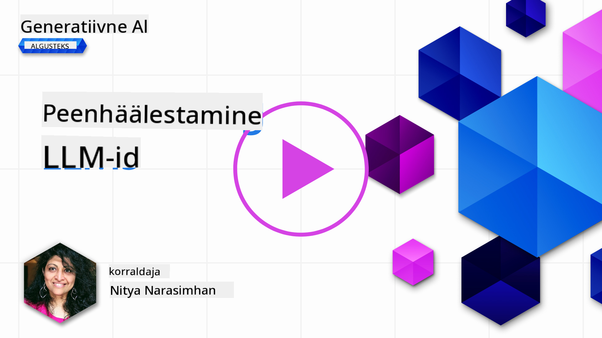
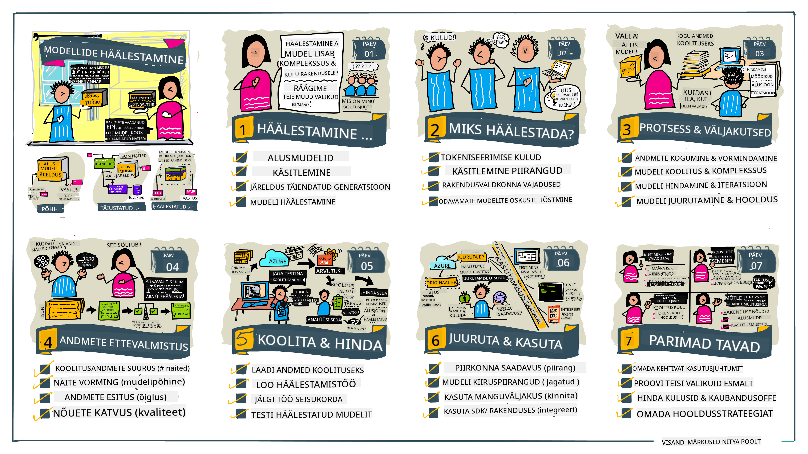

<!--
CO_OP_TRANSLATOR_METADATA:
{
  "original_hash": "807f0d9fc1747e796433534e1be6a98a",
  "translation_date": "2025-10-18T02:54:52+00:00",
  "source_file": "18-fine-tuning/README.md",
  "language_code": "et"
}
-->

# LLM-i peenhäälestamine

Generatiivse tehisintellekti rakenduste loomine suurte keelemudelite abil toob kaasa uusi väljakutseid. Oluline probleem on tagada mudeli poolt genereeritud sisu kvaliteet (täpsus ja asjakohasus) vastavalt kasutaja päringule. Eelnevates tundides arutasime tehnikaid nagu promptide kujundamine ja otsinguga täiendatud genereerimine, mis püüavad probleemi lahendada _muutes olemasoleva mudeli sisendit_.

Tänases tunnis arutame kolmandat tehnikat, **peenhäälestamist**, mis püüab väljakutset lahendada _mudeli enda ümberõpetamisega_ täiendavate andmetega. Sukeldume detailidesse.

## Õpieesmärgid

See tund tutvustab peenhäälestamise kontseptsiooni eelnevalt treenitud keelemudelite jaoks, uurib selle lähenemisviisi eeliseid ja väljakutseid ning annab juhiseid, millal ja kuidas kasutada peenhäälestamist, et parandada generatiivse tehisintellekti mudelite jõudlust.

Tunni lõpuks peaksid sa olema võimeline vastama järgmistele küsimustele:

- Mis on keelemudelite peenhäälestamine?
- Millal ja miks on peenhäälestamine kasulik?
- Kuidas saab eelnevalt treenitud mudelit peenhäälestada?
- Millised on peenhäälestamise piirangud?

Valmis? Alustame.

## Illustreeritud juhend

Kas tahad enne süvitsi minemist saada ülevaate, mida me käsitleme? Vaata seda illustreeritud juhendit, mis kirjeldab õpiteekonda selle tunni jaoks - alates peenhäälestamise põhikontseptsioonide ja motivatsiooni õppimisest kuni protsessi ja parimate praktikate mõistmiseni peenhäälestamise ülesande täitmiseks. See on põnev teema uurimiseks, nii et ära unusta vaadata [Ressursid](./RESOURCES.md?WT.mc_id=academic-105485-koreyst) lehte, et leida lisamaterjale iseseisvaks õppimiseks!

## Mis on keelemudelite peenhäälestamine?

Definitsiooni järgi on suured keelemudelid _eelnevalt treenitud_ suurel hulgal tekstidel, mis pärinevad mitmesugustest allikatest, sealhulgas internetist. Nagu oleme õppinud eelnevates tundides, vajame selliseid tehnikaid nagu _promptide kujundamine_ ja _otsinguga täiendatud genereerimine_, et parandada mudeli vastuste kvaliteeti kasutaja küsimustele ("promptidele").

Populaarne promptide kujundamise tehnika hõlmab mudelile täiendava juhise andmist, mis selgitab, mida vastuses oodatakse, kas _instruktsioonide_ (otsene juhendamine) või _mõne näite andmise_ (kaudne juhendamine) kaudu. Seda nimetatakse _few-shot õppimiseks_, kuid sellel on kaks piirangut:

- Mudeli tokenite piirangud võivad piirata näidete arvu, mida saab anda, ja vähendada tõhusust.
- Mudeli tokenite kulud võivad muuta kalliks näidete lisamise igale promptile ja piirata paindlikkust.

Peenhäälestamine on masinõppe süsteemides levinud praktika, kus võtame eelnevalt treenitud mudeli ja treenime seda uuesti uute andmetega, et parandada selle jõudlust konkreetse ülesande täitmisel. Keelemudelite kontekstis saame eelnevalt treenitud mudelit peenhäälestada _hoolikalt valitud näidete kogumiga konkreetse ülesande või rakenduse valdkonna jaoks_, et luua **kohandatud mudel**, mis võib olla täpsem ja asjakohasem just selle konkreetse ülesande või valdkonna jaoks. Peenhäälestamise kõrvalmõju on see, et see võib vähendada näidete arvu, mida on vaja few-shot õppimiseks - vähendades tokenite kasutust ja sellega seotud kulusid.

## Millal ja miks peaksime mudeleid peenhäälestama?

Selles kontekstis, kui räägime peenhäälestamisest, viitame **juhendatud** peenhäälestamisele, kus ümberõpe toimub **uute andmete lisamisega**, mis ei olnud osa algsest treeningandmestikust. See erineb juhendamata peenhäälestamise lähenemisest, kus mudelit treenitakse uuesti algsete andmetega, kuid erinevate hüperparameetritega.

Oluline on meeles pidada, et peenhäälestamine on keerukas tehnika, mis nõuab teatud tasemel asjatundlikkust, et saavutada soovitud tulemusi. Kui seda tehakse valesti, ei pruugi see anda oodatud parandusi ja võib isegi halvendada mudeli jõudlust sihitud valdkonnas.

Seega, enne kui õpid, "kuidas" keelemudeleid peenhäälestada, pead teadma "miks" peaksid seda teed minema ja "millal" alustada peenhäälestamise protsessi. Alusta endale järgmiste küsimuste esitamisest:

- **Kasutusjuht**: Mis on sinu _kasutusjuht_ peenhäälestamiseks? Millist aspekti praegusest eelnevalt treenitud mudelist tahad parandada?
- **Alternatiivid**: Kas oled proovinud _teisi tehnikaid_, et saavutada soovitud tulemusi? Kasuta neid võrdlusalusena.
  - Promptide kujundamine: Proovi tehnikaid nagu few-shot promptimine asjakohaste vastuste näidetega. Hinda vastuste kvaliteeti.
  - Otsinguga täiendatud genereerimine: Proovi täiendada promte otsingutulemustega, mis on saadud sinu andmete otsingust. Hinda vastuste kvaliteeti.
- **Kulud**: Kas oled tuvastanud peenhäälestamise kulud?
  - Häälestatavus - kas eelnevalt treenitud mudel on peenhäälestamiseks saadaval?
  - Pingutus - treeningandmete ettevalmistamiseks, mudeli hindamiseks ja täiendamiseks.
  - Arvutusvõimsus - peenhäälestamise tööde käivitamiseks ja peenhäälestatud mudeli juurutamiseks.
  - Andmed - piisava kvaliteediga näidete kättesaadavus peenhäälestamise mõju jaoks.
- **Eelised**: Kas oled kinnitanud peenhäälestamise eelised?
  - Kvaliteet - kas peenhäälestatud mudel ületas võrdlusaluse?
  - Kulud - kas see vähendab tokenite kasutust, lihtsustades promte?
  - Laiendatavus - kas saad baasmudelit uute valdkondade jaoks uuesti kasutada?

Neile küsimustele vastates peaksid sa suutma otsustada, kas peenhäälestamine on sinu kasutusjuhtumi jaoks õige lähenemine. Ideaalis on lähenemine õigustatud ainult siis, kui eelised kaaluvad üles kulud. Kui otsustad jätkata, on aeg mõelda, _kuidas_ saad eelnevalt treenitud mudelit peenhäälestada.

Tahad rohkem teavet otsustusprotsessi kohta? Vaata [Kas peenhäälestada või mitte peenhäälestada](https://www.youtube.com/watch?v=0Jo-z-MFxJs)

## Kuidas saame eelnevalt treenitud mudelit peenhäälestada?

Eelnevalt treenitud mudeli peenhäälestamiseks on sul vaja:

- eelnevalt treenitud mudelit, mida peenhäälestada
- andmestikku, mida kasutada peenhäälestamiseks
- treeningkeskkonda peenhäälestamise töö käivitamiseks
- hostimiskeskkonda peenhäälestatud mudeli juurutamiseks

## Peenhäälestamine praktikas

Järgnevad ressursid pakuvad samm-sammult juhendeid, et viia läbi reaalne näide valitud mudeli ja hoolikalt valitud andmestikuga. Nende juhendite läbimiseks on sul vaja konto konkreetse teenusepakkuja juures, samuti juurdepääsu vastavale mudelile ja andmestikele.

| Teenusepakkuja | Juhend                                                                                                                                                                       | Kirjeldus                                                                                                                                                                                                                                                                                                                                                                                                                        |
| -------------- | ---------------------------------------------------------------------------------------------------------------------------------------------------------------------------- | -------------------------------------------------------------------------------------------------------------------------------------------------------------------------------------------------------------------------------------------------------------------------------------------------------------------------------------------------------------------------------------------------------------------------------- |
| OpenAI         | [Kuidas peenhäälestada vestlusmudeleid](https://github.com/openai/openai-cookbook/blob/main/examples/How_to_finetune_chat_models.ipynb?WT.mc_id=academic-105485-koreyst)     | Õpi peenhäälestama `gpt-35-turbo` konkreetse valdkonna jaoks ("retsepti assistent") treeningandmete ettevalmistamise, peenhäälestamise töö käivitamise ja peenhäälestatud mudeli kasutamise kaudu.                                                                                                                                                                                                                              |
| Azure OpenAI   | [GPT 3.5 Turbo peenhäälestamise juhend](https://learn.microsoft.com/azure/ai-services/openai/tutorials/fine-tune?tabs=python-new%2Ccommand-line?WT.mc_id=academic-105485-koreyst) | Õpi peenhäälestama `gpt-35-turbo-0613` mudelit **Azure'is**, tehes samme treeningandmete loomiseks ja üleslaadimiseks, peenhäälestamise töö käivitamiseks. Juuruta ja kasuta uut mudelit.                                                                                                                                                                                                                                       |
| Hugging Face   | [LLM-ide peenhäälestamine Hugging Face'iga](https://www.philschmid.de/fine-tune-llms-in-2024-with-trl?WT.mc_id=academic-105485-koreyst)                                       | See blogipostitus juhendab sind peenhäälestama _avatud LLM-i_ (nt `CodeLlama 7B`) kasutades [transformers](https://huggingface.co/docs/transformers/index?WT.mc_id=academic-105485-koreyst) teeki ja [Transformer Reinforcement Learning (TRL)](https://huggingface.co/docs/trl/index?WT.mc_id=academic-105485-koreyst]) koos avatud [andmestikega](https://huggingface.co/docs/datasets/index?WT.mc_id=academic-105485-koreyst) Hugging Face'is. |
|                |                                                                                                                                                                              |                                                                                                                                                                                                                                                                                                                                                                                                                                  |
| 🤗 AutoTrain   | [LLM-ide peenhäälestamine AutoTrain'iga](https://github.com/huggingface/autotrain-advanced/?WT.mc_id=academic-105485-koreyst)                                                 | AutoTrain (või AutoTrain Advanced) on Hugging Face'i poolt välja töötatud Python teek, mis võimaldab peenhäälestamist paljude erinevate ülesannete jaoks, sealhulgas LLM-i peenhäälestamine. AutoTrain on koodivaba lahendus ja peenhäälestamist saab teha oma pilves, Hugging Face Spaces'is või lokaalselt. See toetab nii veebipõhist GUI-d, CLI-d kui ka treenimist yaml-konfiguratsioonifailide kaudu.                           |
|                |                                                                                                                                                                              |                                                                                                                                                                                                                                                                                                                                                                                                                                  |

## Ülesanne

Vali üks ülaltoodud juhenditest ja tee see läbi. _Võime nende juhendite versioone repositooriumis Jupyter Notebookides reprodutseerida ainult viitamiseks. Palun kasuta otse algallikaid, et saada kõige uuemaid versioone_.

## Tubli töö! Jätka õppimist.

Pärast selle tunni lõpetamist vaata meie [Generatiivse tehisintellekti õppekollektsiooni](https://aka.ms/genai-collection?WT.mc_id=academic-105485-koreyst), et jätkata oma generatiivse tehisintellekti teadmiste arendamist!

Palju õnne!! Oled lõpetanud selle kursuse v2 seeria viimase tunni! Ära lõpeta õppimist ja loomist. \*\*Vaata [RESSURSID](RESOURCES.md?WT.mc_id=academic-105485-koreyst) lehte, et leida täiendavaid soovitusi just selle teema kohta.

Meie v1 tundide seeria on samuti uuendatud rohkemate ülesannete ja kontseptsioonidega. Seega võta hetk, et oma teadmisi värskendada - ja palun [jaga oma küsimusi ja tagasisidet](https://github.com/microsoft/generative-ai-for-beginners/issues?WT.mc_id=academic-105485-koreyst), et aidata meil neid tunde kogukonna jaoks paremaks muuta.

---

**Lahtiütlus**:  
See dokument on tõlgitud AI tõlketeenuse [Co-op Translator](https://github.com/Azure/co-op-translator) abil. Kuigi püüame tagada täpsust, palume arvestada, et automaatsed tõlked võivad sisaldada vigu või ebatäpsusi. Algne dokument selle algses keeles tuleks pidada autoriteetseks allikaks. Olulise teabe puhul soovitame kasutada professionaalset inimtõlget. Me ei vastuta arusaamatuste või valesti tõlgenduste eest, mis võivad tekkida selle tõlke kasutamise tõttu.