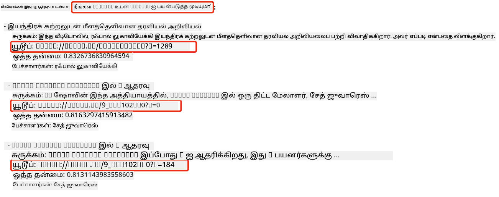
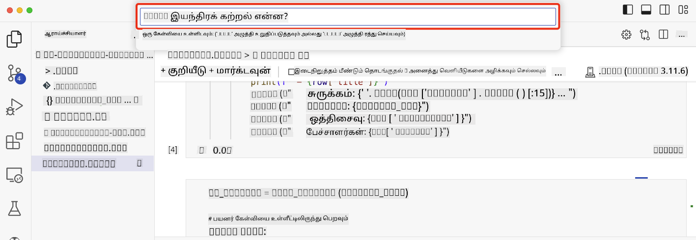

<!--
CO_OP_TRANSLATOR_METADATA:
{
  "original_hash": "58953c08b8ba7073b836d4270ea0fe86",
  "translation_date": "2025-10-18T02:36:20+00:00",
  "source_file": "08-building-search-applications/README.md",
  "language_code": "ta"
}
-->
# தேடல் பயன்பாடுகளை உருவாக்குதல்

[](https://youtu.be/W0-nzXjOjr0?si=GcsqiTTvd7RKbo7V)

> > _மேலே உள்ள படத்தை கிளிக் செய்து இந்த பாடத்தின் வீடியோவைப் பாருங்கள்_

LLM-கள் (பெரிய மொழி மாதிரிகள்) என்பது chatbot-கள் மற்றும் உரை உருவாக்கத்திற்கும் மேலானவை. Embeddings-ஐப் பயன்படுத்தி தேடல் பயன்பாடுகளை உருவாக்கவும் முடியும். Embeddings என்பது தரவின் எண் வடிவங்களாகும், இது வெகுஜன தேடலுக்கு பயன்படுகிறது.

இந்த பாடத்தில், எங்கள் கல்வி தொடக்க நிறுவனத்திற்கான தேடல் பயன்பாட்டை நீங்கள் உருவாக்கப் போகிறீர்கள். எங்கள் தொடக்க நிறுவனம் வளர்ந்து வரும் நாடுகளில் உள்ள மாணவர்களுக்கு இலவச கல்வியை வழங்கும் ஒரு இலாப நோக்கமற்ற அமைப்பாகும். எங்கள் நிறுவனத்திடம் மாணவர்கள் AI பற்றி கற்றுக்கொள்ள YouTube வீடியோக்கள் நிறைய உள்ளன. மாணவர்கள் ஒரு கேள்வியைத் தட்டச்சு செய்வதன் மூலம் YouTube வீடியோவைத் தேட அனுமதிக்கும் ஒரு தேடல் பயன்பாட்டை உருவாக்க எங்கள் நிறுவனம் விரும்புகிறது.

உதாரணமாக, ஒரு மாணவர் 'Jupyter Notebooks என்றால் என்ன?' அல்லது 'Azure ML என்றால் என்ன?' என்று தட்டச்சு செய்யலாம், அப்போது தேடல் பயன்பாடு அந்த கேள்விக்கு தொடர்புடைய YouTube வீடியோக்களின் பட்டியலை திருப்பி அனுப்பும். மேலும், தேடல் பயன்பாடு அந்த கேள்விக்கு பதில் இருக்கும் வீடியோவின் இடத்தைச் சுட்டும் இணைப்பை திருப்பி அனுப்பும்.

## அறிமுகம்

இந்த பாடத்தில், நாம் கற்றுக்கொள்ளப் போவது:

- Semantic தேடல் மற்றும் Keyword தேடல்.
- Text Embeddings என்றால் என்ன.
- Text Embeddings Index உருவாக்குதல்.
- Text Embeddings Index-ல் தேடுதல்.

## கற்றல் இலக்குகள்

இந்த பாடத்தை முடித்த பிறகு, நீங்கள்:

- Semantic தேடல் மற்றும் Keyword தேடலின் வித்தியாசத்தை கூற முடியும்.
- Text Embeddings என்றால் என்ன என்பதை விளக்க முடியும்.
- Embeddings-ஐப் பயன்படுத்தி தரவுகளைத் தேட பயன்பாட்டை உருவாக்க முடியும்.

## ஏன் தேடல் பயன்பாட்டை உருவாக்க வேண்டும்?

தேடல் பயன்பாட்டை உருவாக்குவது Embeddings-ஐப் பயன்படுத்தி தரவுகளைத் தேடுவது எப்படி என்பதைப் புரிந்து கொள்ள உதவும். மேலும், மாணவர்கள் விரைவாக தகவல்களை கண்டறிய பயன்படும் ஒரு தேடல் பயன்பாட்டை உருவாக்குவது எப்படி என்பதை நீங்கள் கற்றுக்கொள்வீர்கள்.

இந்த பாடத்தில் Microsoft [AI Show](https://www.youtube.com/playlist?list=PLlrxD0HtieHi0mwteKBOfEeOYf0LJU4O1) YouTube சேனலின் உரை பதிவுகளுக்கான Embedding Index அடங்கும். AI Show என்பது AI மற்றும் இயந்திர கற்றல் பற்றி கற்றுக்கொடுக்க ஒரு YouTube சேனல் ஆகும். Embedding Index Oct 2023 வரை உள்ள YouTube உரை பதிவுகளுக்கான Embeddings-ஐ கொண்டுள்ளது. எங்கள் தொடக்க நிறுவனத்திற்கான தேடல் பயன்பாட்டை உருவாக்க நீங்கள் Embedding Index-ஐப் பயன்படுத்துவீர்கள். தேடல் பயன்பாடு கேள்விக்கு பதில் இருக்கும் வீடியோவின் இடத்தைச் சுட்டும் இணைப்பை திருப்பி அனுப்பும். இது மாணவர்கள் தங்களுக்கு தேவையான தகவல்களை விரைவாகக் கண்டறிய ஒரு சிறந்த வழியாகும்.

'can you use rstudio with azure ml?' என்ற கேள்விக்கான ஒரு semantic தேடல் உதாரணம் கீழே கொடுக்கப்பட்டுள்ளது. YouTube URL-ஐப் பாருங்கள், URL ஒரு timestamp-ஐ கொண்டுள்ளது, இது அந்த கேள்விக்கு பதில் இருக்கும் வீடியோவின் இடத்திற்குச் செல்கிறது.



## Semantic தேடல் என்றால் என்ன?

இப்போது நீங்கள் கேட்கலாம், Semantic தேடல் என்றால் என்ன? Semantic தேடல் என்பது ஒரு தேடல் தொழில்நுட்பமாகும், இது ஒரு கேள்வியில் உள்ள வார்த்தைகளின் semantics அல்லது அர்த்தத்தைப் பயன்படுத்தி தொடர்புடைய முடிவுகளை திருப்பி அனுப்புகிறது.

இங்கே ஒரு Semantic தேடல் உதாரணம் உள்ளது. நீங்கள் ஒரு கார் வாங்க விரும்பினால், நீங்கள் 'என் கனவு கார்' என்று தேடலாம். Semantic தேடல் நீங்கள் ஒரு காரை `கனவு காணவில்லை`, ஆனால் உங்கள் `சிறந்த` காரை வாங்க விரும்புகிறீர்கள் என்பதைப் புரிந்து கொள்கிறது. Semantic தேடல் உங்கள் நோக்கத்தைப் புரிந்து கொண்டு தொடர்புடைய முடிவுகளை திருப்பி அனுப்புகிறது. மாற்றாக, `keyword தேடல்` என்பது கார்களைப் பற்றிய கனவுகளை நேரடியாக தேடுகிறது மற்றும் பெரும்பாலும் தொடர்பற்ற முடிவுகளை திருப்பி அனுப்புகிறது.

## Text Embeddings என்றால் என்ன?

[Text embeddings](https://en.wikipedia.org/wiki/Word_embedding?WT.mc_id=academic-105485-koreyst) என்பது [இயற்கை மொழி செயலாக்கம்](https://en.wikipedia.org/wiki/Natural_language_processing?WT.mc_id=academic-105485-koreyst) பயன்படுத்தப்படும் ஒரு உரை பிரதிநிதித்துவ தொழில்நுட்பமாகும். Text embeddings என்பது உரையின் semantic எண் வடிவங்களாகும். Embeddings தரவுகளை ஒரு இயந்திரம் எளிதாக புரிந்து கொள்ளும் வகையில் பிரதிநிதித்துவப்படுத்த பயன்படுத்தப்படுகிறது. Text embeddings உருவாக்க பல மாதிரிகள் உள்ளன, இந்த பாடத்தில், OpenAI Embedding Model-ஐப் பயன்படுத்தி embeddings உருவாக்குவதில் கவனம் செலுத்துவோம்.

இங்கே ஒரு உதாரணம் உள்ளது, AI Show YouTube சேனலின் ஒரு எபிசோடின் உரை பதிவில் உள்ள உரையை கற்பனை செய்யுங்கள்:

```text
Today we are going to learn about Azure Machine Learning.
```

உரையை OpenAI Embedding API-க்கு அனுப்பினால், அது 1536 எண்களைக் கொண்ட embedding-ஐ aka ஒரு vector-ஐ திருப்பி அனுப்பும். இந்த vector-இல் உள்ள ஒவ்வொரு எண்ணும் உரையின் வெவ்வேறு அம்சத்தை பிரதிநிதித்துவப்படுத்துகிறது. சுருக்கமாக, vector-இல் முதல் 10 எண்கள் இங்கே உள்ளன:

```python
[-0.006655829958617687, 0.0026128944009542465, 0.008792596869170666, -0.02446001023054123, -0.008540431968867779, 0.022071078419685364, -0.010703742504119873, 0.003311325330287218, -0.011632772162556648, -0.02187200076878071, ...]
```

## Embedding Index எப்படி உருவாக்கப்பட்டது?

இந்த பாடத்திற்கான Embedding Index Python script-களின் தொடர்ச்சியால் உருவாக்கப்பட்டது. இந்த பாடத்திற்கான 'scripts' கோப்பகத்தில் உள்ள [README](./scripts/README.md?WT.mc_id=academic-105485-koreyst) மற்றும் script-களுடன் உங்களுக்குத் தேவையான வழிமுறைகள் கிடைக்கும். இந்த பாடத்தை முடிக்க இந்த script-களை இயக்க தேவையில்லை, ஏனெனில் Embedding Index உங்களுக்காக வழங்கப்பட்டுள்ளது.

script-கள் பின்வரும் செயல்பாடுகளைச் செய்கின்றன:

1. [AI Show](https://www.youtube.com/playlist?list=PLlrxD0HtieHi0mwteKBOfEeOYf0LJU4O1) playlist-இல் உள்ள ஒவ்வொரு YouTube வீடியோவிற்கான உரை பதிவும் பதிவிறக்கம் செய்யப்படுகிறது.
2. [OpenAI Functions](https://learn.microsoft.com/azure/ai-services/openai/how-to/function-calling?WT.mc_id=academic-105485-koreyst) பயன்படுத்தி, YouTube உரை பதிவின் முதல் 3 நிமிடங்களில் இருந்து பேச்சாளர் பெயரை எடுக்க முயற்சி செய்யப்படுகிறது. ஒவ்வொரு வீடியோவிற்கும் பேச்சாளர் பெயர் `embedding_index_3m.json` என்ற Embedding Index-இல் சேமிக்கப்படுகிறது.
3. உரை பதிவின் உரை **3 நிமிட உரை பகுதிகளாக** துண்டிக்கப்படுகிறது. ஒவ்வொரு பகுதிக்கும் அடுத்த பகுதியில் இருந்து சுமார் 20 வார்த்தைகள் ஒட்டியிருக்கும், இது பகுதியின் Embedding துண்டிக்கப்படாமல் இருக்கவும், தேடல் சூழலை மேம்படுத்தவும் உதவுகிறது.
4. ஒவ்வொரு உரை பகுதியும் OpenAI Chat API-க்கு அனுப்பப்படுகிறது, இது உரையை 60 வார்த்தைகளாக சுருக்குகிறது. சுருக்கம் `embedding_index_3m.json` என்ற Embedding Index-இல் சேமிக்கப்படுகிறது.
5. இறுதியாக, பகுதி உரை OpenAI Embedding API-க்கு அனுப்பப்படுகிறது. Embedding API பகுதியின் semantic அர்த்தத்தை பிரதிநிதித்துவப்படுத்தும் 1536 எண்களைக் கொண்ட vector-ஐ திருப்பி அனுப்புகிறது. பகுதி மற்றும் OpenAI Embedding vector `embedding_index_3m.json` என்ற Embedding Index-இல் சேமிக்கப்படுகிறது.

### Vector தரவுத்தொகுப்புகள்

பாடத்தின் எளிமைக்காக, Embedding Index `embedding_index_3m.json` என்ற JSON கோப்பில் சேமிக்கப்பட்டு Pandas DataFrame-இல் ஏற்றப்படுகிறது. ஆனால், உற்பத்தியில், Embedding Index [Azure Cognitive Search](https://learn.microsoft.com/training/modules/improve-search-results-vector-search?WT.mc_id=academic-105485-koreyst), [Redis](https://cookbook.openai.com/examples/vector_databases/redis/readme?WT.mc_id=academic-105485-koreyst), [Pinecone](https://cookbook.openai.com/examples/vector_databases/pinecone/readme?WT.mc_id=academic-105485-koreyst), [Weaviate](https://cookbook.openai.com/examples/vector_databases/weaviate/readme?WT.mc_id=academic-105485-koreyst) போன்ற vector தரவுத்தொகுப்புகளில் சேமிக்கப்படும்.

## Cosine Similarity-ஐப் புரிந்து கொள்வது

Text embeddings பற்றி நாம் கற்றுக்கொண்டோம், அடுத்த படியாக text embeddings-ஐப் பயன்படுத்தி தரவுகளை தேடுவது எப்படி என்பதை கற்றுக்கொள்வோம், குறிப்பாக ஒரு கேள்விக்கான embedding-களுடன் மிகச் சமீபத்திய embedding-களை cosine similarity-ஐப் பயன்படுத்தி கண்டறிவது.

### Cosine Similarity என்றால் என்ன?

Cosine similarity என்பது இரண்டு vector-களின் ஒற்றுமையை அளவிடும் ஒரு அளவீடாகும், இதை `nearest neighbor search` என்றும் அழைக்கிறார்கள். Cosine similarity தேடலைச் செய்ய, OpenAI Embedding API-ஐப் பயன்படுத்தி _query_ உரையை _vectorize_ செய்ய வேண்டும். பின்னர் query vector மற்றும் Embedding Index-இல் உள்ள ஒவ்வொரு vector-இன் _cosine similarity_ ஐ கணக்கிட வேண்டும். நினைவில் கொள்ளுங்கள், Embedding Index ஒவ்வொரு YouTube உரை பகுதி text segment-க்கான vector-ஐ கொண்டுள்ளது. இறுதியாக, cosine similarity மூலம் முடிவுகளை வரிசைப்படுத்துங்கள், அதிக cosine similarity கொண்ட text segment-கள் query-க்கு மிகவும் ஒத்ததாக இருக்கும்.

கணிதக் கோணத்தில், cosine similarity என்பது பலவகை பரிமாண இடத்தில் இரண்டு vector-களின் கோணத்தின் cosine-ஐ அளவிடுகிறது. இந்த அளவீடு பயனுள்ளதாக உள்ளது, ஏனெனில் Euclidean தூரத்தால் இரண்டு ஆவணங்கள் வெகுதூரமாக இருந்தாலும், அவை சிறிய கோணத்தைக் கொண்டிருக்கலாம், எனவே அதிக cosine similarity-ஐக் கொண்டிருக்கலாம். Cosine similarity சமன்பாடுகள் பற்றிய கூடுதல் தகவலுக்கு, [Cosine similarity](https://en.wikipedia.org/wiki/Cosine_similarity?WT.mc_id=academic-105485-koreyst) ஐப் பார்க்கவும்.

## உங்கள் முதல் தேடல் பயன்பாட்டை உருவாக்குதல்

அடுத்ததாக, Embeddings-ஐப் பயன்படுத்தி ஒரு தேடல் பயன்பாட்டை உருவாக்குவது எப்படி என்பதை கற்றுக்கொள்வோம். தேடல் பயன்பாடு மாணவர்கள் ஒரு கேள்வியைத் தட்டச்சு செய்வதன் மூலம் ஒரு வீடியோவைத் தேட அனுமதிக்கும். தேடல் பயன்பாடு கேள்விக்கு தொடர்புடைய வீடியோக்களின் பட்டியலை திருப்பி அனுப்பும். மேலும், தேடல் பயன்பாடு அந்த கேள்விக்கு பதில் இருக்கும் வீடியோவின் இடத்தைச் சுட்டும் இணைப்பை திருப்பி அனுப்பும்.

இந்த தீர்வு Windows 11, macOS மற்றும் Ubuntu 22.04-ல் Python 3.10 அல்லது அதற்கு மேல் பயன்படுத்தி உருவாக்கப்பட்டது மற்றும் சோதிக்கப்பட்டது. [python.org](https://www.python.org/downloads/?WT.mc_id=academic-105485-koreyst) இல் இருந்து Python-ஐ பதிவிறக்கலாம்.

## பணிக்குறிப்பு - மாணவர்களுக்கு தேடல் பயன்பாட்டை உருவாக்க உதவுதல்

இந்த பாடத்தின் தொடக்கத்தில் எங்கள் தொடக்க நிறுவனத்தை அறிமுகப்படுத்தினோம். இப்போது மாணவர்கள் தங்கள் மதிப்பீடுகளுக்கான தேடல் பயன்பாட்டை உருவாக்க உதவ நேரம் வந்துள்ளது.

இந்த பணிக்குறிப்பில், நீங்கள் தேடல் பயன்பாட்டை உருவாக்க பயன்படுத்தப்படும் Azure OpenAI Services-ஐ உருவாக்குவீர்கள். நீங்கள் பின்வரும் Azure OpenAI Services-ஐ உருவாக்க வேண்டும். இந்த பணிக்குறிப்பை முடிக்க Azure சந்தாதாரத்திற்குத் தேவைப்படும்.

### Azure Cloud Shell-ஐ தொடங்கவும்

1. [Azure portal](https://portal.azure.com/?WT.mc_id=academic-105485-koreyst) இல் உள்நுழைக.
2. Azure portal-இல் மேலே வலது மூலையில் உள்ள Cloud Shell ஐகானைத் தேர்ந்தெடுக்கவும்.
3. சூழல் வகையாக **Bash** ஐத் தேர்ந்தெடுக்கவும்.

#### Resource Group உருவாக்கவும்

> இந்த வழிமுறைகளுக்கு, "semantic-video-search" என்ற resource group-ஐ East US-ல் பயன்படுத்துகிறோம்.
> Resource group-இன் பெயரை நீங்கள் மாற்றலாம், ஆனால் resource-களுக்கான இடத்தை மாற்றும்போது,
> [model availability table](https://aka.ms/oai/models?WT.mc_id=academic-105485-koreyst) ஐச் சரிபார்க்கவும்.

```shell
az group create --name semantic-video-search --location eastus
```

#### Azure OpenAI Service resource உருவாக்கவும்

Azure Cloud Shell-இல் இருந்து, Azure OpenAI Service resource-ஐ உருவாக்க பின்வரும் கட்டளையை இயக்கவும்.

```shell
az cognitiveservices account create --name semantic-video-openai --resource-group semantic-video-search \
    --location eastus --kind OpenAI --sku s0
```

#### இந்த பயன்பாட்டில் பயன்பாட்டிற்கான endpoint மற்றும் keys-ஐப் பெறவும்

Azure Cloud Shell-இல் இருந்து, Azure OpenAI Service resource-க்கான endpoint மற்றும் keys-ஐப் பெற பின்வரும் கட்டளைகளை இயக்கவும்.

```shell
az cognitiveservices account show --name semantic-video-openai \
   --resource-group  semantic-video-search | jq -r .properties.endpoint
az cognitiveservices account keys list --name semantic-video-openai \
   --resource-group semantic-video-search | jq -r .key1
```

#### OpenAI Embedding model-ஐ deploy செய்யவும்

Azure Cloud Shell-இல் இருந்து, OpenAI Embedding model-ஐ deploy செய்ய பின்வரும் கட்டளையை இயக்கவும்.

```shell
az cognitiveservices account deployment create \
    --name semantic-video-openai \
    --resource-group  semantic-video-search \
    --deployment-name text-embedding-ada-002 \
    --model-name text-embedding-ada-002 \
    --model-version "2"  \
    --model-format OpenAI \
    --sku-capacity 100 --sku-name "Standard"
```

## தீர்வு

GitHub Codespaces-ல் உள்ள [solution notebook](./python/aoai-solution.ipynb?WT.mc_id=academic-105485-koreyst) ஐத் திறந்து Jupyter Notebook-இல் உள்ள வழிமுறைகளைப் பின்பற்றவும்.

நீங்கள் notebook-ஐ இயக்கும்போது, உங்களிடம் ஒரு query-ஐ உள்ளிடுமாறு கேட்கப்படும். உள்ளீட்டு பெட்டி இவ்வாறு இருக்கும்:



## சிறந்த வேலை! உங்கள் கற்றலை தொடருங்கள்

இந்த பாடத்தை முடித்த பிறகு, எங்கள் [Generative AI Learning collection](https://aka.ms/genai-collection?WT.mc_id=academic-105485-koreyst) ஐப் பாருங்கள், உங்கள் Generative AI அறிவை மேலும் மேம்படுத்த!

Lesson 9-க்கு செல்லுங்கள், அங்கு [பட உருவாக்க பயன்பாடுகளை உருவாக்குவது](../09-building-image-applications/README.md?WT.mc_id=academic-105485-koreyst) எப்படி என்பதைப் பார்ப்போம்!

---

**குறிப்பு**:  
இந்த ஆவணம் AI மொழிபெயர்ப்பு சேவை [Co-op Translator](https://github.com/Azure/co-op-translator) பயன்படுத்தி மொழிபெயர்க்கப்பட்டுள்ளது. நாங்கள் துல்லியத்திற்காக முயற்சிக்கிறோம், ஆனால் தானியங்கி மொழிபெயர்ப்புகளில் பிழைகள் அல்லது தவறுகள் இருக்கக்கூடும் என்பதை கவனத்தில் கொள்ளவும். அதன் தாய்மொழியில் உள்ள மூல ஆவணம் அதிகாரப்பூர்வ ஆதாரமாக கருதப்பட வேண்டும். முக்கியமான தகவல்களுக்கு, தொழில்முறை மனித மொழிபெயர்ப்பு பரிந்துரைக்கப்படுகிறது. இந்த மொழிபெயர்ப்பைப் பயன்படுத்துவதால் ஏற்படும் எந்த தவறான புரிதல்கள் அல்லது தவறான விளக்கங்களுக்கு நாங்கள் பொறுப்பல்ல.